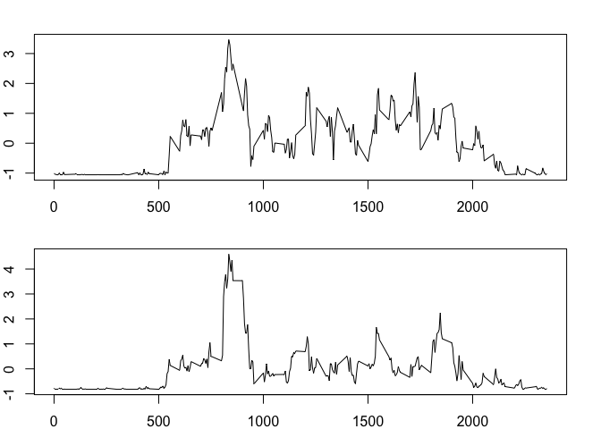

## Loading and preprocessing the data  


```r
steps <- read.csv("activity.csv")
steps$date <- as.Date(steps$date, "%Y-%m-%d")
steps$date <- as.factor(steps$date)
```

## What is mean total number of steps taken per day?  


```r
steps_per_day <- tapply(steps$steps,steps$date,sum,na.rm=TRUE)
hist(steps_per_day,breaks = 16 )

abline(v=mean(steps_per_day), col="blue")

abline(v=median(steps_per_day),col="purple")
```

<!-- -->

```r
mean(steps_per_day)
```

```
## [1] 9354.23
```

```r
median(steps_per_day)
```

```
## [1] 10395
```

the median its of 10395 steps and the mean its of 9354.23

## What is the average daily activity pattern?


```r
steps$interval <- as.factor(steps$interval)
steps_per_int <- tapply(steps$steps,steps$int,mean,na.rm=TRUE)
intervals <- as.numeric(as.vector(unique(steps$interval)))
plot(intervals,steps_per_int,type="l")
```

<!-- -->

```r
max_steps <- max(steps_per_int)
int_steps <- cbind(steps_per_int,intervals)
subset(int_steps, steps_per_int==max_steps)
```

```
##     steps_per_int intervals
## 835      206.1698       835
```

the maximum number of steps in average per day interval is in the 835-840 interval  
the number of steps is of 206.1628

## Imputing missing values


```r
sum(is.na(steps$steps))
```

```
## [1] 2304
```

there is a total of 2304 missing values


```r
filling <- function(a,b) {
    a <- if (is.na(a)==TRUE) {
        c <- subset(int_steps,intervals==b)
        d <- c[1,1]
        d
    } else {
        a
    }
    a
}

new_steps <- steps

new_steps$steps <- mapply(filling,steps$steps,steps$interval)

steps_per_day <- tapply(new_steps$steps,new_steps$date,sum,na.rm=TRUE)

hist(steps_per_day,breaks=16)

abline(v=mean(steps_per_day), col="blue")

abline(v=median(steps_per_day),col="purple")
```

<!-- -->

```r
mean(steps_per_day)
```

```
## [1] 10766.19
```

```r
median(steps_per_day)
```

```
## [1] 10766.19
```

The values of the mean and the median differ from the original set  
filling the missing values increase the values of the mean and the   
median, from 9354.23 to 10766.19 and from 10395 to 10766.19 respectivly

## Are there differences in activity patterns between weekdays and weekends?


```r
week_days <- function(x) {
    if (weekdays(x) %in%  c("Monday","Tuesday","Wensday","Thursday","Friday")) {
        return ("Weekday")
    }
    return("Weekend")
}

steps$Weekdays <- sapply(as.Date(steps$date),week_days)
```


```r
par(mfrow=c(2,1),mar=c(2,2,2,2))

week_end <- subset(steps, Weekdays=="Weekend")
steps_int_weekend <- tapply(week_end$steps,week_end$int,mean,na.rm=TRUE)


week_day <- subset(steps, Weekdays=="Weekday")
steps_int_weekday <- tapply(week_day$steps,week_day$int,mean,na.rm=TRUE)


plot(intervals,scale(steps_int_weekend),type = "l", ylab = "Number of steps")
plot(intervals,scale(steps_int_weekday),type = "l", ylab = "Number of steps")
```

<!-- -->

There is not significant evidence of a differentiation bettwen weekdays and   
weekends in the average number of steps by day.
